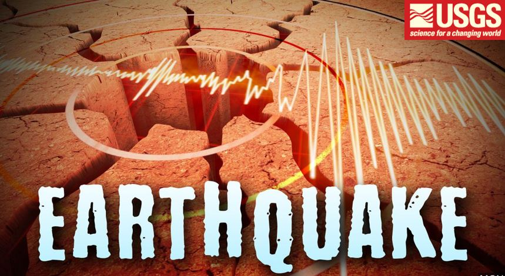

# Leaflet-Challenge - Visualizing Data with Leaflet
**Submitted By:** Saloni Gupta\
_Date_: february, 21st, 2020 

## Background
This respository uses United States Geological Survey, or USGS for short! USGS data which is responsible for providing scientific data about natural hazards, the health of our ecosystems and environment; and the impacts of climate and land-use change. Their scientists develop new methods and tools to supply timely, relevant, and useful information about the Earth and its processes.

In this project we can visualize earthquake data using html,css,Javascript, and Leaflet.

## The Task
### Level 1: Earthquakes Basic Visualization
Using USGS GeoJSON Feed to get the data, and visualize all Earthquakes from the Past 7 Days. Earthquake data can be found at [USGS GeoJSON Feed page](https://earthquake.usgs.gov/earthquakes/feed/v1.0/geojson.php)

- The map is created by using Leaflet that plots all of the earthquakes from the data set based on their longitude and latitude.
- Data markers are used to reflect the magnitude and depth of the earthquake in their size and color. Earthquakes with higher magnitudes should appear larger and the color spectrum started from green to red, wich means when depth increases the color goes from green to red.
  - Popups included to provide additional information about the earthquake when a marker is clicked. 
  - Legend added to provide context of the map data.  

### Level 2: Earthquakes Advanced Visualization
In this task, added a second data(layer) set on the map to illustrate the relationship between tectonic plates and seismic activity. Data on tectonic plates can be found at https://github.com/fraxen/tectonicplates.

In this task:

- Ploted a second data set on the map.

- Added a number of base maps to choose from as well as separate out our two different data sets into overlays that can be turned on and off independently.

- Add a layer controls to the map.

### The Final View Looks as Follows :
